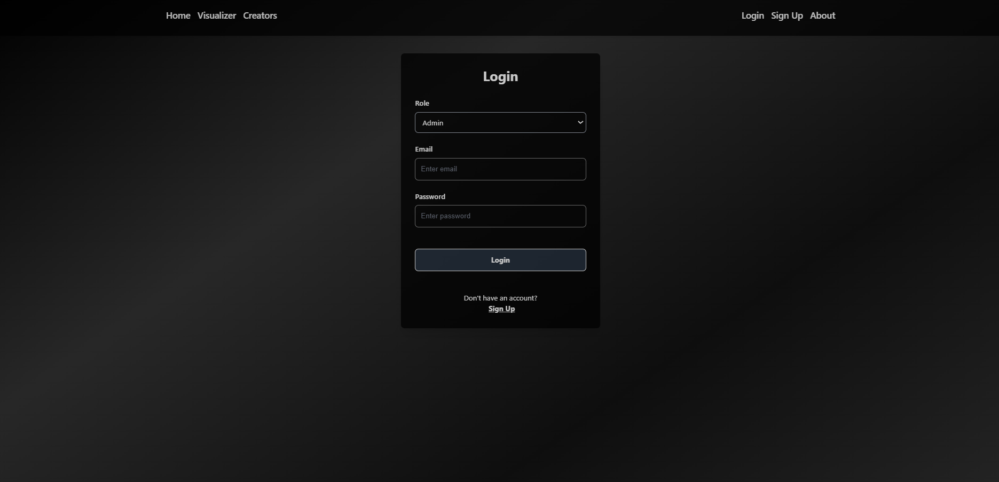

# Movie Viz
Movie Analytics Visualization With Review System<br>
[Movie Viz](https://movievisualizer.onrender.com)

# Description
<p style="text-align: justify;">This project is designed to offer an interactive and insightful platform for exploring movie analytics, while also integrating a user review system. It allows users to search for detailed movie information based on their preferences, enabling them to discover films by genre, release year, and more. Users can compare different movies, analyzing aspects such as ratings, genres, and box office performance. The platform also provides insights into actors and directors, showcasing their top hits and lesser-known works. Visual analytics allow users to explore data on top-rated movies, highest budgets, and highest-grossing films, with options to filter by genre. Admins can manage the database by adding, updating, or removing entries, and users can contribute reviews that impact movie ratings, making the platform dynamic and community-driven.</p>

# Team Members
[Aaditya Joshi](https://github.com/AadityaX86)<br>
[Abhijeet K.C.](https://github.com/Abhijeet-KC)<br> 
[Ankit Neupane](https://github.com/AnkitNeupane007)

# Installation
Setup on Local Machine:
- Clone the Repository<br>
```
git clone https://github.com/AnkitNeupane007/movie_viz.git
```
- Install Requirements<br>
    - Install Python on Your Device
    - Run the Following Python Command in Your Terminal<br>
    ```
    pip install -r requirements.txt
    ```
- Run the Code
    - Make a `.env` File and Add it to the `.\movies_site` Directory of this Project. Follow these Guidelines in the `.env` File:


        ```env
        SECRET_KEY = 'your_secret_key'
        DATABASE_URL = 'your_db_url'
        OMDB_API_KEY = 'ombd_key'
        TMDB_API_KEY = 'tmdb_key'
        ```
    - Run the Following Python Command in Your Terminal<br>
    ```
    python .\main.py
    ```
# Tech Stack
### Frontend
- HTML(Jinja Templating), CSS, JavaScript<br>
- Chart.js<br>
- Tailwind CSS
### Backend
- Flask
### Database
- SQLite
### Hosting
- Render

# Usage

### User's
- User's don't need to do Login/Register if they want to View Movie Details
- Users can view Movie Details in the `Home` Page, Visualizations in the `Visualization` Page, Actors and Directors in the `Creation` Page


<div style="display: flex;">
  
  
  
</div>
<br>

- Users can Sign Up as a Reviewer through the `Sign Up` Page


### Reviewer's
- Reviewer's need to Login as a Reviewer through the `Login` Page





- Reviewer's can Review Movies Through `Dashboard`


### Admin
- Admin can Update User's Profile and Insert Additional Movies Through `Dashboard`
<div style="display: flex;">
  
  
</div>